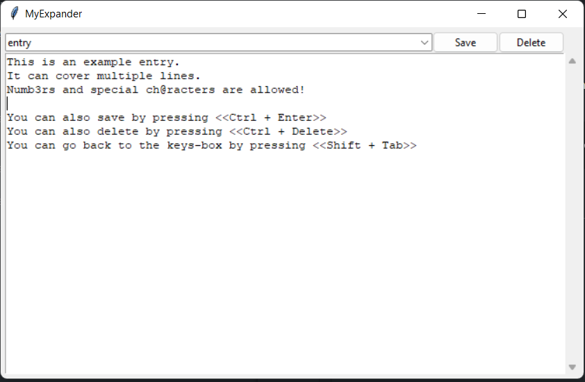

MyExpander
===
Ever been annoyed at the amount of text you had to repeat? No more! This basic app is the text expander you (or me at least) have been waiting for. 

# Features
- Expand any textbody with a expander key followed by a space.
- Easy and fast creation of expander keys. 
- Choose custom dictionaries. 
- Intuitive UI with Tkinter
- Main function embedded in class "Gui", can allow for usage within other Tkinter applications in the future. 
- Fuzzy matches and sort while sorting

# Usage
>'keyboard' module is required. Special thanks to maintainer [boppreh](https://github.com/boppreh):
    
    pip install keyboard
>Otherwise: run via:

    python expander.py

>**Choose your own dictionary:** with the **"-f"** argument. By default MyExpander will use a dictionary.csv file for your definitions. If it isn't present in the directory this program will create it.

    python expander.py -f myowndictionary.csv

# Video Demo

[MyExpander | Demo](https://youtu.be/pEFhrvbkZvg)

# Example 

# Functionality
## Expander keys

- Add your expander keys in the uppermost box.
    - They cannot contain spaces. 
    - '_' is allowed, but only at the beginning.
    - Other special characters are allowed.

## Expander text 

- Expander text is in the lowermost box. 
    - If you select an existing expander key it will show that key's text.
    - Expander text can be edited here.
    - Editing here does not update to the dictionary. Only "Save" or "Delete" actually commit your changes.

## Save and Delete

- Press the "Save" button to save or update the currently selected dictionary.
    - Alternatively \<Ctrl + Enter> can be used.
- Press the "Delete" button delete currently selected entry.
    - Alternatively \<Ctrl + Del> can be used.
- **Note:** These actions are irreversible.

## Expanding text

- Happens automatically when this program is minimized. 
    - Just type one of your expander keys followed by "\<spacebar>"
    - Note: Expanding is disabled when the window is not minimized to allow to edit keys without expanding them inside the GUI. 

# Limitations
- Only support for Windows
- GUI is very basic in style.
- List of keys only show on \<Arrow-Down>.
- Expand costs some fraction of time. Particularly of note with lengthy expands. 
- Every update of your dictionary immediately re-writes the csv. 
    - Advantage: Almost no chance of data loss.
    - Disadvantage: Might become slow if dict is extremely large. 
- Error messages are still relatively generic.

